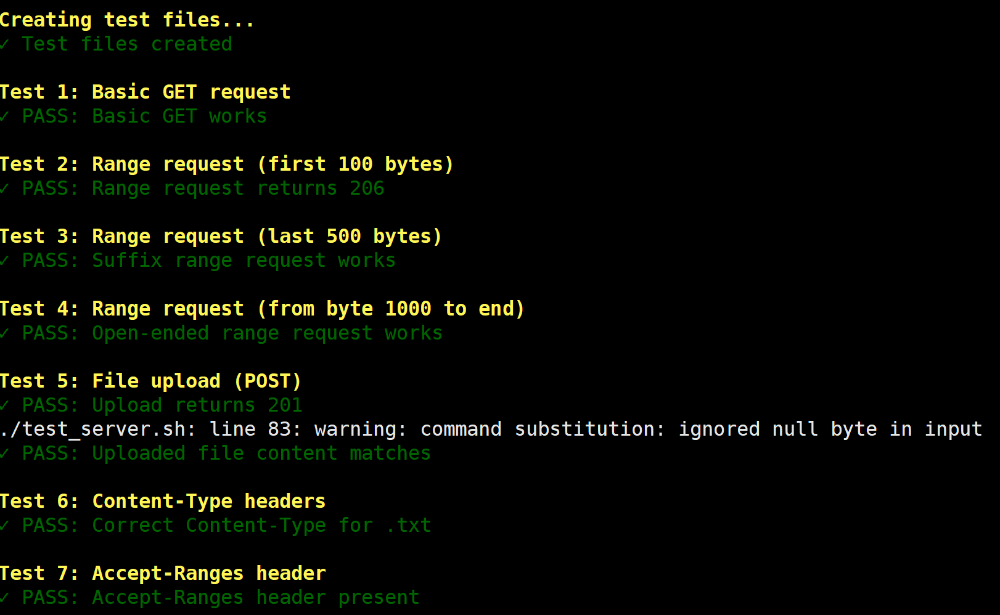

# io_uring vs epoll: HTTP Server and File Server Comparison

## Overview

This project compares Linux io_uring and epoll by measuring their performance in two different server workloads:

1. An HTTP server (from the original project)
2. A file server (added in this project)

The original code comes from: https://github.com/chen622/uring-server

That project focuses on comparing io_uring and epoll using an HTTP workload. This repository builds on that work by adding a file server to study how both approaches behave when file I/O becomes the main performance bottleneck.

## What Changed From the Original Project

The original repository:
- Implements HTTP servers using io_uring and epoll
- Focuses on network I/O performance

This project adds:
- A file server implemented using io_uring
- A file server implemented using epoll
- Benchmarking and analysis scripts for file-serving workloads

The HTTP server code is reused for comparison purposes. The file server code and benchmarking additions are new.

## Why a File Server?

HTTP workloads often involve small responses and protocol parsing.
A file server shifts the focus toward:
- Large file reads
- Disk I/O behavior
- Interaction between file I/O and network I/O

This makes it easier to observe where io_uring provides benefits over traditional epoll-based designs.

## Code Layout
- fileserver_iouring.c: File server using io_uring
- fileserver_epoll.c: File server using epoll
- fileserver.h: Shared file server definitions
- quick_benchmark.sh: Script for running basic benchmarks
- syscall_analysis.sh: Script for system call analysis
- nginx.jmx: JMeter workload configuration

## Requirements

- Linux kernel 5.6 or newer (for io_uring support)
- gcc
- liburing
- JMeter (only required for benchmarking)

To install liburing on Ubuntu:

```bash
sudo apt install liburing-dev
```

## Building the Servers

Compile the servers using gcc.

### Build the io_uring file server

```bash
gcc -o fileserver_iouring fileserver_iouring.c -luring
```

### Build the epoll file server

```bash
gcc -o fileserver_epoll fileserver_epoll.c
```

(Compilation commands for the HTTP servers follow the same pattern as the original repository.)

## Running the Servers

### Run the io_uring file server

```bash
./fileserver_iouring <port>
```

Example:

```bash
./fileserver_iouring 8080
```

### Run the epoll file server

```bash
./fileserver_epoll <port>
```

Example:

```bash
./fileserver_epoll 8080
```

The server will listen on the specified port and serve files from the current working directory.

## Running Benchmarks

To run a quick benchmark:

```bash
./quick_benchmark.sh
```

For deeper analysis of system call behavior:

```bash
./syscall_analysis.sh
```

JMeter can be used with the provided `nginx.jmx` file to generate load and compare throughput and latency between the different servers.

## Evaluation and Results

At this stage, our evaluation focuses on the static file server using io_uring. These experiments are used to verify correctness and understand baseline performance before completing a direct comparison with the epoll-based implementation.

### Concurrency and Throughput

The figure below shows how throughput changes as the number of concurrent clients increases for the io_uring file server.


### Functionality Verification

This figure shows results from basic functionality tests used to verify correct behavior of the io_uring file server under different request patterns.



### System Call Distribution

Using `strace`, we measured the distribution of system calls to understand syscall behavior and overhead in the io_uring implementation.


### Notes

A brief summary of the current evaluation results is available [here](https://github.com/NoahBeto/ecs251/blob/main/evaluation/summary.txt)

The epoll-based evaluation is currently in progress and will be added once testing is complete.

## Attribution

The HTTP server implementations are derived from: https://github.com/chen622/uring-server

All file server implementations and benchmarking extensions were added for this project as part of ECS 251.

## Course Context

This project was developed for ECS 251 to explore modern Linux I/O mechanisms and understand the tradeoffs between io_uring and epoll under different workloads.
