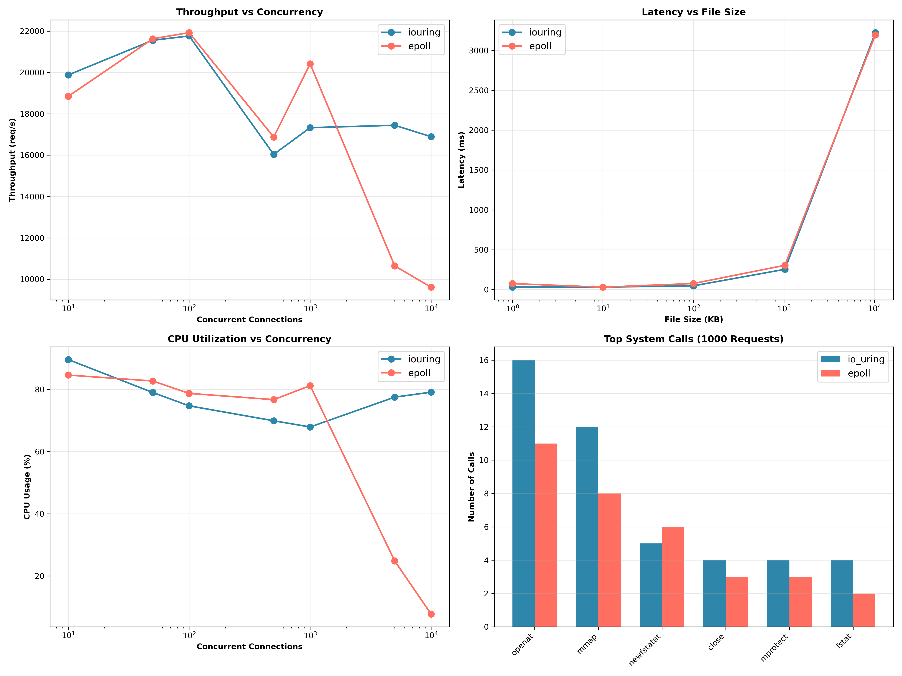
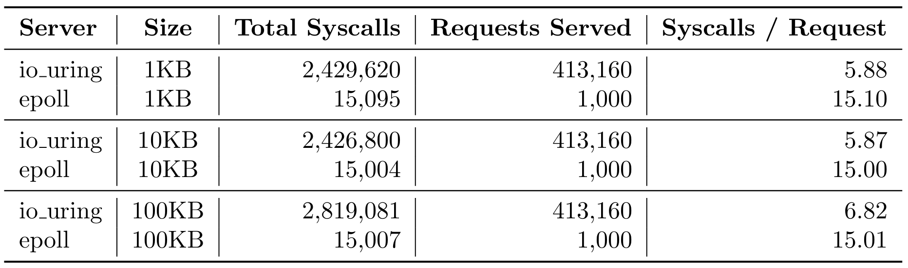

# io_uring vs epoll: HTTP Server and File Server Comparison

## Overview

This project compares Linux io_uring and epoll by measuring their performance in two different server workloads:

1. An HTTP server (from the original project)
2. A file server (added in this project)

The original code comes from: https://github.com/chen622/uring-server

That project focuses on comparing io_uring and epoll using an HTTP workload. This project builds on that work by adding a file server to look at how both approaches behave when file I/O becomes the main performance bottleneck.

## What Changed From the Original Project

The original repository:
- Implements HTTP servers using io_uring and epoll
- Focuses on network I/O performance

This project adds:
- A file server implemented using io_uring
- A file server implemented using epoll
- Benchmarking and analysis scripts for file-serving workloads

The code for the file servers, benchmarks, and visualizers are new.

## Why a File Server?

HTTP workloads often involve small responses and protocol parsing.  
A file server shifts the focus toward:
- Large file reads
- Disk I/O behavior
- Interaction between file I/O and network I/O

This makes it easier to observe where io_uring provides benefits over traditional designs using epoll.

## Code Layout
- `fileserver_iouring.c`: File server using io_uring
- `fileserver_epoll.c`: File server using epoll
- `fileserver.h`: Shared definitions used by both servers
- `benchmarks`: Contains all benchmarks used to test epoll and io_uring servers
- `evaluation`: Contains figures and results of epoll and io_uring
- `visualizations`: Code used to generate the figures and visualizations from the benchmark results

**Additional Notes:**
- There is also a folder `benchmarks/benchmark_cpu_tests` containing additional CPU-focused benchmarks. While these are not directly used in the main evaluation, results are available there.

## Requirements

- Linux kernel 5.6 or newer (for io_uring support)
- gcc
- liburing
- JMeter (only required for benchmarking)
- Docker Desktop (for Mac support)

To install liburing on Ubuntu:

```bash
sudo apt install liburing-dev
```
### Docker Setup (Mac)

**Note:** Some commands below open an interactive shell inside a Docker container.  
While inside the container, Docker commands will not work. If you need to return to your host terminal to run another Docker command, type:

```bash
exit
```

For Mac, open docker in the terminal. 

To set up a docker container, run the following command to enter ubuntu:
```bash
docker run --rm -it \
  --security-opt seccomp=unconfined \
  -v "$(pwd)":/src \
  -w /src \
  ubuntu:latest
```
and then
```bash
docker compose run dev
``` 
to make use of the yml configuration.

<!-- ```bash
apt update && apt install -y liburing-dev build-essential gcc
apt-get update
apt-get install -y build-essential cmake
gcc -o fileserver_epoll fileserver_epoll.c websever.c -luring
cd build
../fileserver_epoll
``` -->

and to run after the container has been built, run
```bash
docker compose up -d
docker compose exec dev bash
```

Run 
```bash
pip install --no-cache-dir matplotlib --break-system-packages
```
to install matplotlib on the VM. --break-system-packages is being used to get around building a virtual environment, which remains fine 

## Building the Servers

Compile the servers using gcc.

### Build the io_uring file server

```bash
gcc -o fileserver_iouring fileserver_iouring.c -luring
```

### Build the epoll file server

```bash
gcc -o fileserver_epoll fileserver_epoll.c
```

(Compilation commands for the HTTP servers follow the same pattern as the original repository.)

## Running the Servers

### Run the io_uring file server

```bash
./fileserver_iouring <port>
```

Example:

```bash
./fileserver_iouring 8000
```

### Run the epoll file server

```bash
./fileserver_epoll <port>
```

Example:

```bash
./fileserver_epoll 8000
```

The server will listen on the specified port and serve files from the current working directory.

## Running Benchmarks

To run a benchmark, open another terminal and run the following:

```bash
./benchmark_<Linux_kernel_interface>_<size>.sh
```

Example:

```bash
./benchmark_epoll_1KB.sh
```

## Evaluation and Results

Our evaluation now includes both static file server implementations using **io_uring** and **epoll**, with performance measured across different file sizes and concurrency levels.

Each benchmark figure contains four graphs:

- **Top-left graph:** throughput as concurrent connections increase  
- **Top-right graph:** latency as file size increases  
- **Bottom-left graph:** CPU usage as concurrency increases  
- **Bottom-right graph:** system calls used most often during testing (epoll only)

The following subsections present results grouped by file size.

### 1 KB File Benchmarks


- **Throughput:** At low concurrency, both io_uring and epoll perform similarly. As concurrency increases, epoll throughput drops sharply, while io_uring scales better and maintains higher throughput.  
- **Latency:** Latency is low for both systems. io_uring generally maintains slightly lower latency than epoll.  
- **CPU Utilization:** io_uring maintains stable CPU usage as concurrency increases. Epoll CPU usage drops under high load, indicating reduced efficiency.

---

### 10 KB File Benchmarks



- **Throughput:** io_uring continues to scale better at higher concurrency. Epoll throughput declines more noticeably under load.  
- **Latency:** Latency increases slightly as file size grows. io_uring maintains similar or slightly lower latency than epoll.  
- **CPU Utilization:** io_uring CPU usage remains steady, while epoll drops at high concurrency.

---

### 100 KB File Benchmarks


- **Throughput:** io_uring maintains higher throughput than epoll under increasing concurrency, though the difference is less dramatic than for smaller files.  
- **Latency:** Latency increases for both systems. For 100 KB files, io_uring latency grows slightly faster at the largest file sizes, likely because data transfer time dominates over syscall overhead.  
- **CPU Utilization:** io_uring remains more efficient and maintains steadier CPU usage. Epoll CPU usage drops at high connection counts, showing less efficient handling of heavy load.

---

### System Call Comparison

To provide a complete comparison of **syscall overhead**, we created `fileserver_iouring_wcount.c` to count `io_uring_submit()` calls. Using these counts and `strace` for epoll, we generated the following table:



**Context:**

- Using `strace` while running 1000 requests at concurrency 100, epoll performs ~15 system calls per request across all file sizes.  
- For io_uring, counting `io_uring_submit()` calls results in ~6 calls per request.  
- **Explanation:** Epoll requires separate system calls for waiting, reading, and writing, while io_uring can submit multiple operations through shared ring buffers. This reduces syscall overhead and improves efficiency.

All results now include **direct comparisons between epoll and io_uring**, demonstrating how io_uring reduces syscall overhead and improves performance for file-serving workloads.

## Frequent Problems
- If a script does not have sufficient permissions to execute, run the following snippet to make it executable
```bash
chmod +x insert script name
``` 
- The benchmarks are hardcoded to localhost:8000. Please run with 8000 until this is patched.

## Attribution

The HTTP server implementations are derived from: https://github.com/chen622/uring-server

All file server implementations, benchmarking extensions, and visualizers were added for this project as part of ECS 251.

## Course Context

This project was developed for ECS 251 to explore modern Linux I/O mechanisms and understand the tradeoffs between io_uring and epoll under different workloads.