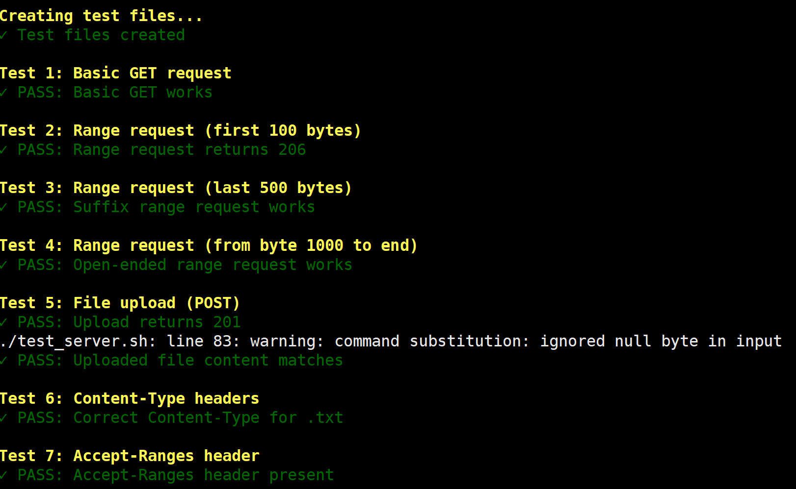

# io_uring vs epoll: HTTP Server and File Server Comparison

## Overview

This project compares Linux io_uring and epoll by measuring their performance in two different server workloads:

1. An HTTP server (from the original project)
2. A file server (added in this project)

The original code comes from: https://github.com/chen622/uring-server

That project focuses on comparing io_uring and epoll using an HTTP workload. This project builds on that work by adding a file server to look at how both approaches behave when file I/O becomes the main performance bottleneck.

## What Changed From the Original Project

The original repository:
- Implements HTTP servers using io_uring and epoll
- Focuses on network I/O performance

This project adds:
- A file server implemented using io_uring
- A file server implemented using epoll
- Benchmarking and analysis scripts for file-serving workloads

The codes for the file servers, benchmarks, and visualizers are new.

## Why a File Server?

HTTP workloads often involve small responses and protocol parsing.
A file server shifts the focus toward:
- Large file reads
- Disk I/O behavior
- Interaction between file I/O and network I/O

This makes it easier to observe where io_uring provides benefits over traditional designs using epoll.

## Code Layout
- fileserver_iouring.c: File server using io_uring
- fileserver_epoll.c: File server using epoll
- fileserver.h: Shared definitions used by both servers
- benchmarks: folder that contains all benchmarks used to test the performance of epoll and io_uring servers
- evaluation: folder that contains figures and results of epoll and io_uring
- visualizations: contains the code used to generate the figures and visualizations from the benchmark results

## Requirements

- Linux kernel 5.6 or newer (for io_uring support)
- gcc
- liburing
- JMeter (only required for benchmarking)
- Docker Desktop (for Mac support)

To install liburing on Ubuntu:

```bash
sudo apt install liburing-dev
```
### Special Mac Instructions (TODO)
For Mac, open docker in the terminal. 

To set up a docker container, run the following command to enter ubuntu:
```bash
docker run --rm -it \
  --security-opt seccomp=unconfined \
  -v "$(pwd)":/src \
  -w /src \
  ubuntu:latest
```
and then
```bash
docker compose run dev
``` 
to make use of the yml configuration.

<!-- ```bash
apt update && apt install -y liburing-dev build-essential gcc
apt-get update
apt-get install -y build-essential cmake
gcc -o fileserver_epoll fileserver_epoll.c websever.c -luring
cd build
../fileserver_epoll
``` -->

and to run after the container has been built, run
```bash
docker compose up -d
docker compose exec dev bash
```

Run 
```bash
pip install --no-cache-dir matplotlib --break-system-packages
```
to install matplotlib on the VM. --break-system-packages is being used to get around building a virtual environment, which remains fine 

## Building the Servers

Compile the servers using gcc.

### Build the io_uring file server

```bash
gcc -o fileserver_iouring fileserver_iouring.c -luring
```

### Build the epoll file server

```bash
gcc -o fileserver_epoll fileserver_epoll.c
```

(Compilation commands for the HTTP servers follow the same pattern as the original repository.)

## Running the Servers

### Run the io_uring file server

```bash
./fileserver_iouring <port>
```

Example:

```bash
./fileserver_iouring 8000
```

### Run the epoll file server

```bash
./fileserver_epoll <port>
```

Example:

```bash
./fileserver_epoll 8000
```

The server will listen on the specified port and serve files from the current working directory.

## Running Benchmarks

To run a benchmark, open another terminal and run the following:

```bash
./benchmark_<Linx_kernel_interface>_<size>.sh
```

Example:

```bash
./benchmark_epoll_1KB.sh
```

## Evaluation and Results

At this stage, our evaluation focuses on the static file server using io_uring. These experiments are used to verify correctness and understand baseline performance before completing a direct comparison with the implementation using epoll.

### Functionality Verification

This figure shows results from basic functionality tests used to verify correct behavior of the io_uring file server under different request patterns.



### Performance and System Analysis

This figure shows how the io_uring file server performed during testing. The top left graph shows throughput as the number of concurrent connections increases. Performance improves at first, then drops once the load becomes too high. The top right graph shows latency for different file sizes. Smaller files are handled quickly, but latency increases as file size grows.

The bottom left graph shows CPU usage steadily rising as more connections are added. The bottom right chart lists the system calls used most often during testing, with openat and mmap appearing the most, followed by others like fstat and close.

### Notes

A brief summary of the current evaluation results is available [here](https://github.com/NoahBeto/ecs251/blob/main/evaluation/io_uring_summary.txt)

The evaluation for epoll is currently in progress and will be added once testing is complete.

## Frequent Problems
- If a script does not have sufficient permissions to execute, run the following snippet to make it executable
```bash
chmod +x insert script name
``` 
- The benchmarks are hardcoded to localhost:8000. Please run with 8000 until this is patched.


## Attribution

The HTTP server implementations are derived from: https://github.com/chen622/uring-server

All file server implementations, benchmarking extensions, and visualizers were added for this project as part of ECS 251.

## Course Context

This project was developed for ECS 251 to explore modern Linux I/O mechanisms and understand the tradeoffs between io_uring and epoll under different workloads.